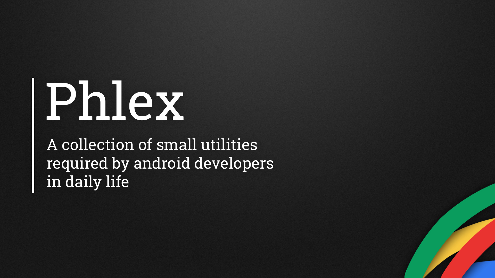

# Phlex

> I am making a collection of small utilities required by most of the android developers in daily life like `isFirstRun()`, `isDataAvailable()`, `getScreenHeight()` and many more.

> _Why write something again when it's already written ?_



# How to use !

- Add dependency in your module's `build.gradle` file
```
dependencies {
		// ... other dependencies here
	    	compile 'com.md.phlex:phlex:0.0.2'
	}
```

- Sync your project with gradle file.
- Start using methods. Like `Phlex.isFirstRun(this)`

# Currently available methods
	
-	`isFirstRun(SharedPreferences sharedPreferences)`
	*	Returns `true` or `false`
	
-	`isFirstRun(Context context)`
	*	Returns `true` or `false`
	*	Uses apps default SharedPreferences file
	
-	`isDataAvailable(Context context)`
	*	Returns `true` or `false`
	
-	`isEmailIdValid(String emailId)`	
	*	Returns `true` or `false`

-	`isAppVersionUpdated(Context context)`
	* Returns `true` if `versionCode` of build.gradle is incremented
	* By default returns true on first run.
	
-	`isAppVersionUpdated(Context context, SharedPreferences sharedPreferences)`
	*	Same as above method it just uses SharedPreferences file provided by user
	
-	`getScreenWidth()` or `getScreenHeight()`
	*	Returns integer value
	
-	`getXPercentOfY(int X, int Y)`
	*	You can also use float, long or double
	* 	Returns value depending on datatype used
	
-	`getThisFromAssets(Context context, String fileName)`
	*	Returns contents of files as a `String`
	*	Provide file name with extension like `sample.json`
	*	_Tip: Use with text files like *.txt, *.json etc_
	
-	`switchfragment(AppCompatActivity activity, View container, Fragment fragment)`
	*	Switches `fragment` in the `container` view
	
-	`switchfragment(AppCompatActivity activity, View container, Fragment fragment, String toolbarTitle)`
	*	Switches `fragment` in the `container` view
	*	Also changes the toolbar's title if available

-	`setToolbarElevation(Toolbar toolbar, View toolbarShadow, int elevation)`
	*	Sets toolbar elevation to `elevation` if device is LOLLIPOP+ and hides `toolbarShadow` view
	*	Else unhides `toolbarShadow` view
	*	_Tip: Very useful for backward compatibility_
	
-	`isPreLollipop()`
	*	Returns `true` if device is pre-lollipop
	*	_Tip: Useful for backward compatibility_
	
-	`isLollipopPlus()`
	*	Returns `true` if device is lollipop or lollipop plus
	*	_Tip: Useful for backward compatibility_	

-	`dp2px(int dp)`
	*	Returns `px` value of the provided `dp`
	*	You can also use `float`

-	`px2dp(int px)`
	*	Returns `dp` value of the provided `px`
	*	You can also use `float`
	
-	`isAppInstalled(Context context, String appPackageName)`
	*	Returns `true` or `false`	
	
> _Note: I know this is too less but more methods will be available soon. You can send your ideas or contributions to me at mddanishansaridev@gmail.com_

# License

    Copyright 2016 MD Danish Ansari

    Licensed under the Apache License, Version 2.0 (the "License");
    you may not use this file except in compliance with the License.
    You may obtain a copy of the License at

       http://www.apache.org/licenses/LICENSE-2.0

    Unless required by applicable law or agreed to in writing, software
    distributed under the License is distributed on an "AS IS" BASIS,
    WITHOUT WARRANTIES OR CONDITIONS OF ANY KIND, either express or implied.
    See the License for the specific language governing permissions and
    limitations under the License.
